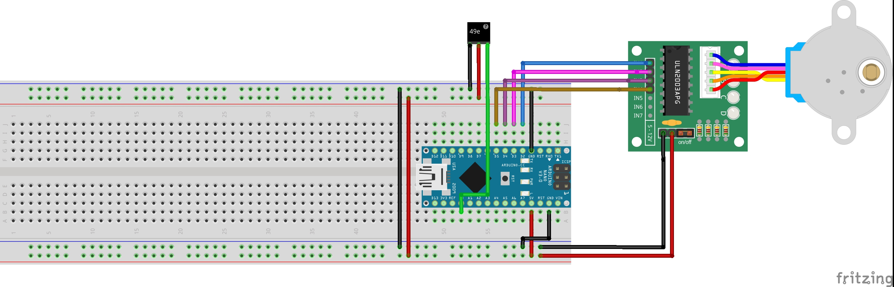
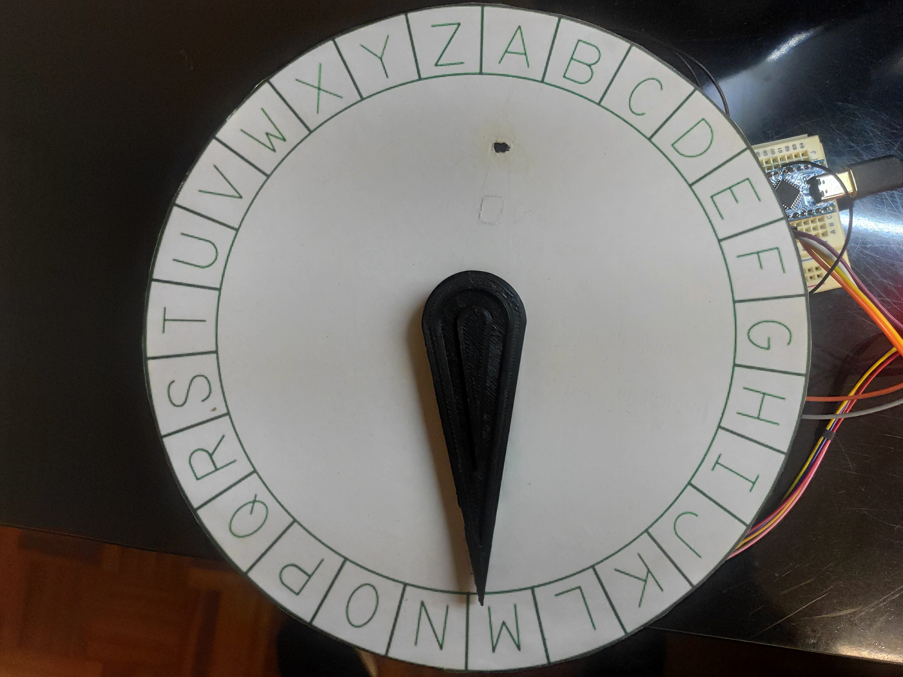

# Crypto-Servo-Interaction

The Crypto Servo Interaction is a mini game that was developed for my Master Thesis "Developing a Support Infrastructure for an Escape The Room and Peddy Paper Games".

This mini game, or interaction as I so call it, was developed to be part of an Escape the Room game that was also developed as part of my thesis. Since this interaction can work as a standalone mini game I decided to place it here for anyone interested in using it.

## List of Components

- 28BYJ-48 Stepper Motor (1x);
- 28BYJ-48 Driver (1x);
- SS49E Hall Sensor (1x);
- [Magnet M1219-5](https://www.ptrobotics.com/sensor-hall/929-magnet-m1219-5-neodyium-iron-boron.html) (1x);
- Arduino Nano (1x);

In order to fully assemble the Interaction, so as to look like the picture below, you will also need to 3D Print the enclosure which is divided into two parts that can be found [here](enclosure/).

## The Purpose of The Game

This game has the purpose of teaching cryptography to the player. The way it works is the following:

1. A random word is selected from an [hardcoded array](https://github.com/pmsmm/Crypto-Servo-Interaction/blob/a2b44304d0d30496c4fe41aaf888da554f806926/CryptoServoInteraction.ino#L8);

2. The selected word is encrypted using a random shift factor and the game starts;

The way this mini game was built was with the intent of being used with a support infrastructure that was designed for my master thesis so there is no way of introducing the solution and have the interaction acknowledge that solution as right or wrong (Yet this can be achieved with a very simple modification to the existing code, something I will consider doing in the future).

None the less, the interaction can be used with the purpose of teaching Cryptography, specifically the Caesar cipher, by having the interaction decipher the cryptographic text generated at the beginning. To do this the player must introduce in the serial mointor of the Arduino IDE the following command:

1. > `CMD:MSG;MSG:########;ID:123456789`

Where the ######## corresponds to the encrypted message that is to be deciphered. The interaction receives the encrypted message and then proceeds to use the arrow to point to the deciphered letter.

### Example

Lets assume that the generated shift factor makes the letter A correspond to the letter B, the letter Z correspond to the letter A and, finally, the letter L corresponds to the letter N. 

If a user introduces the command `CMD:MSG;MSG:AZLZLZ;ID:123456789` then the interaction will proceed to point to the letters **B -> A -> N -> A -> N -> A** revealing the original message which was BANANA.

## Warning

The source code for this interaction contains a lot of logic that was made to communicate with the infrastructure that was developed for my thesis and therefor it is not as clean as it could be when compared to a mini game that is developed with the intent of being used by the Arduino IDE directly.